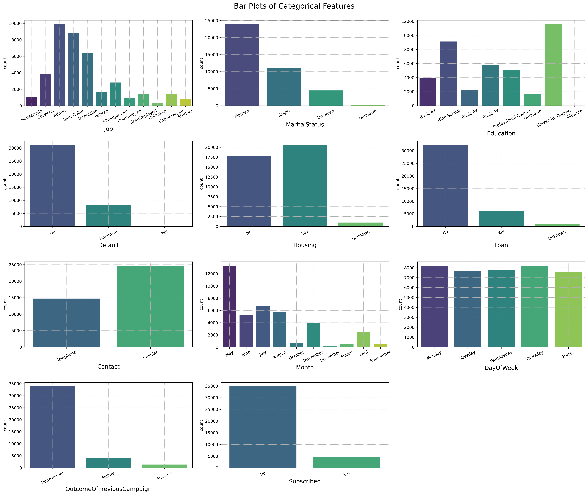
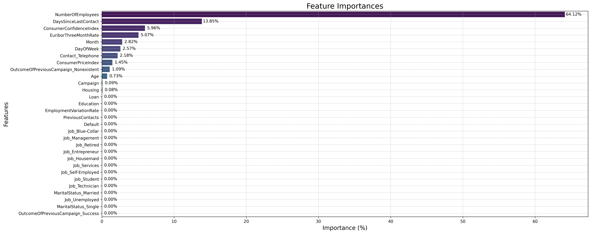

# Comparing Classifiers

## Overview

The purpose of this project is to evaluate the performance of various classifiers (Logistic Regression, KNN, Decision Tree, Random Forest, and SVM) on a dataset related to the marketing of bank products over the phone. The goal is to predict if a customer will subscribe to a term deposit.

Notebook can be found here: [Comparing Classifiers]()

## Dataset

The dataset used in this project is the [Bank Marketing Dataset](https://archive.ics.uci.edu/dataset/222/bank+marketing) from the [UCI Machine Learning Repository](https://archive.ics.uci.edu/). The dataset contains the following features:

- `Age`: The customer's age.
- `Job`: The customer's job.
- `MaritalStatus`: The marital staus of the customer.
- `Education`: The customer's education.
- `Default`: Does the customer have credit in default?
- `Housing`: Does the customer have a housing loan?
- `Loan`: Does the customer have a personal loan?
- `Contact`: How was the customer contacted (cellular or telephone)?
- `Month`: Last month of the year the customer was contacted.
- `DayOfWeek`: Last day of the week the customer was contacted.
- `Duration`: The duration of the last contact with the customer, in seconds.
- `Campaign`: Number of contacts performed during this campaign and for this client.
- `DaysSinceLastContact`: Number of days that passed by after the client was last contacted from a previous campaign.
- `PreviousContacts`: Number of contacts performed before this campaign and for this client.
- `OutcomeOfPreviousCampaign`: Outcome of the previous marketing campaign.
- `EmploymentVariationRate`: Employment Variation Rate - Quarterly Indicator
- `ConsumerPriceIndex`: Consumer Price Index - Quarterly Indicator
- `ConsumerConfidenceIndex`: Consumer Confidence Index - Quarterly Indicator
- `EuriborThreeMonthRate`: Euribor 3-Month Rate - Quarterly Indicator
- `NumberOfEmployees`: Number of Employees - Quarterly Indicator
- `Subscribed`: Has the client subscribed to a term deposit?

The target variable is `Subscribed`.

There are a total of 21 features (including the target variable) and 41,188 data points.

## Methods

The process for completing this project was broken down into several subproblems:

- **Problem 1:** Understanding the Data
- **Problem 2:** Read in the Data
- **Problem 3:** Understanding the Features
- **Problem 4:** Understanding the Task
- **Problem 5:** Engineering Features
- **Problem 6:** Train/Test Split
- **Problem 7:** A Baseline Model
- **Problem 8:** A Simple Model
- **Problem 9:** Score the Model
- **Problem 10:** Model Comparisons
- **Problem 11:** Improving the Model

### Problem 1: Understanding the Data

**Question:** "To gain a better understanding of the data, please read the information provided in the UCI link above, and examine the **Materials and Methods** section of the paper. How many marketing campaigns does this data represent?"

**Answer:** The data presented in the "Materials and Methods" section of the paper represents multiple marketing campaigns conducted by a Portuguese retail bank from May 2008 to June 2013, encompassing a total of 52,944 phone contacts. However, the specific number of individual campaigns within this period is not explicitly mentioned. Instead, the section describes the overall methodology and data analysis for the telemarketing efforts over the five-year period.

### Problem 2: Read in the Data

The dataset was loaded.

#### Data Exploration

Some information was gathered about the dataset and some transformations were made in order to improve the aesthetics, ease of use, and performance of future models:

- Feature names were changed from their original values to improve readability and desriptiveness.
- Importantly, the `Duration` column was dropped immediately. According to the authors with regard to the `Duration` column:
  - "Important note: this attribute highly affects the output target (e.g., if duration=0 then y='no'). Yet, the duration is not known before a call is performed. Also, after the end of the call y is obviously known. Thus, this input should only be included for benchmark purposes and should be discarded if the intention is to have a realistic predictive model."
- Basic information about the dataset was generated.
- The categorical and numerical features were examined separately.
  - For the categorical features, unique values in these columns were examined and transformed and cleaned up (converted to title case, removed unnecessaary characters, etc.).
  - For numerical features, basic statistics like mean, median, standard deviation, minimum and maximum values were calculated to understand the distribution and identify any potential outliers.

#### Data Quality Assessment

- The dataset was checked for missing values.
  - No missing values were found.
- The dataset was checked for duplicate rows.
  - 1,784 duplicate rows were found
  - Since this was a relatively small proportion of the dataset (~4.33% of rows), these duplicates were dropped to simplify modeling.
  - This left 39,404 rows in the dataset.
- The balance of the target variable (`Subscribed`) was examined to determine if the classes were imbalanced.
  - The classes were found to be imbalanced.
  - There were 34,806 / 39,404 instances (~88.33%) where `Subscribed`=='No'.
  - There were 4,598 / 39,404 instances (~11.67%) where `Subscribed`=='Yes'.

#### Data Visualization

Several visualization were created to help better understand the dataset and examine relationships between features. These can be seen below:

### Problem 3: Understanding the Features

A summary of findings about the dataset was composed:

- The dataset initially contained 41,188 entries and now contains 41,176 entries after duplicates were removed.
- The dataset contains 21 columns.
- There are a mix of numeric, categorical, and binary data types across the columns.
- There don't appear to be any missing values.
- Numerical Features: Age, Duration, Campaign, DaysSinceLastContact, PreviousContacts, EmploymentVariationRate, ConsumerPriceIndex, ConsumerConfidenceIndex, EuriborThreeMonthRate, NumberOfEmployees.
- Categorical Features: Job, MaritalStatus, Education, Default, Housing, Loan, Contact, Month, DayOfWeek, OutcomeOfPreviousCampaign, Subscribed.
- All categorical variables will need to be encoded for modeling. Some categorical variables are essentially binary (e.g., `Default`, `Housing`, `Loan`, `Subscribed`), indicating yes/no outcomes. Others, like `Education`, have a natural order and could be treated as ordinal data. Finally, features like `Job`, have no natural order and will need to be one-hot encoded.
- There are a fair number of 'Unknown' values in various columns. These values can be treated as missing data and imputed or dropped as needed.
- The `Subscribed` column is the target variable for predictive modeling, indicating whether a client subscribed to a term deposit. This is a binary outcome and could be modeled as such.
- The target variable is highly unbalanced, with 88.73% of the data being `No` and 11.26% of the data being `Yes`. This imbalance will need to be addressed.
- Features like `Job` and `Education` have high cardinality with many unique values, which might require special consideration during feature encoding for model training.
- Preliminary visualizations suggest the presence of outliers and varied distributions in numerical data, which might need normalization or other preprocessing steps for more effective modeling.

### Problem 4: Understanding the Task

**Task:** "After examining the description and data, your goal now is to clearly state the Business Objective of the task. State the objective below."

**Response:** The business objective is to predict whether a client will subscribe to a term deposit using the features in the dataset. To make this prediction, various classification models will be trained and evaluated to determine the best performing model for this task.

### Problem 5: Engineering Features

In this section, the features and target variable were transformed and encoded to prepare them for modeling.

- First, all categorical features were checked to determine the prevalence of 'Unknown' values.

| Features      | Number of 'Unknown' Values |
| ------------- | -------------------------- |
| Job           | 325                        |
| MaritalStatus | 79                         |
| Education     | 1686                       |
| Default       | 8266                       |
| Housing       | 980                        |
| Loan          | 980                        |

  - The `Default` feature was further examined since there were such a large number of 'Unknown' values. Upon closer examination, the distribution of values in the `Default` column was:
    - 'No': 31,135 Instances
    - 'Yes': 3 Instances
    - 'Unknown': 8,266 Instances
      - Since there were only 3 instances where 'Default' was 'Yes', these rows were removed from the dataset as they will likely have little to no predictive power.
      - The remaining 'No' and 'Unknown' values were left as they were.
  - For the other features with 'Unknown' values, a systematic approach was applied to impute these missing values. Using a Decision Tree Classifier, each feature's 'Unknown' values were predicted based on other available features in the dataset. The process involved:
    - Separating the data into subsets where the feature values were known and unknown.
    - Encoding the categorical data and ensuring alignment of feature columns between the training data (known values) and the data to be imputed (unknown values).
    - Training the Decision Tree model on the known dataset and then using it to predict the 'Unknown' values.
    - Imputing these predicted values back into the original dataset.
    - This method was applied to the features `Job`, `MaritalStatus`, `Education`, `Housing`, and `Loan`.
  - The `Default`, `Housing`, `Loan`, and `Subscribed` features were then binary encoded ('No' = 0 and 'Unknown'/'Yes' = 1) since they represent yes/no outcomes.
  - The `Education`, `Month`, and `DayOfWeek` features were label encoded.
  - The remaining categorical features were one-hot encoded.

### Problem 6: Train/Test Split

The data was split into a training set comprised of 80% of the available data points and a test set comprised of the remaining 20%.

### Problem 7: A Baseline Model

The purpose of this section was to establish a baseline model for comparison with more complex models later in the analysis. The simplest baseline was chosen: a model that predicts the majority class (i.e., 'No') for all instances, also known as a Dummy Classifier. The performance of this model is reflected in the distribution of the target variable - the baseline accuracy is the proportion of the majority class, or 88.33%.

### Problem 8: A Simple Model

Next, a simple model was created using Logistic Regression. This model will serve as a starting point for comparison with more complex models.

### Problem 9: Score the Model

The results of this model's performance were as follows:

Training Time: 0.1337 seconds
Training Accuracy: 89.7335%
Test Accuracy: 89.4810%

### Problem 10: Model Comparisons

Next, several models were built: KNN, Decision Tree, Random Forest, and SVM.

The same training and test sets were used for all models, and they were trained without any hyperparameter tuning. The results were as follows:

| Model Name          | Training Time (Seconds) | Training Accuracy (%) | Test Accuracy (%) |
| ------------------- | ----------------------- | --------------------- | ----------------- |
| Logistic Regression | 0.1305                  | 89.7335               | 89.4810           |
| KNN                 | 0.0081                  | 90.9803               | 88.6182           |
| Decision Tree       | 0.1275                  | 99.4924               | 83.0225           |
| Random Forest       | 2.0807                  | 99.4892               | 88.4786           |
| SVM                 | 29.6407                 | 89.6796               | 89.3288           |

### Problem 11: Improving the Model

The best performing model was the Random Forest model, which had a training accuracy of 99.4892% and a test accuracy of 88.4786%.

The models were then trained once more with hyperparameter tuning to see if the performance could be improved. The hyperparameters tuned for each model were:

- Logistic Regression: `C`, `penalty`.
- KNN: `n_neighbors`, `weights`, and `metric`.
- Decision Tree: `criterion`, `max_depth`, `min_samples_split`, and `min_samples_leaf`.
- Random Forest: `n_estimators`, `max_depth`, `min_samples_split`, and `min_samples_leaf`.
- SVM: `kernel`, and `C`.

Results after tuning:

| Model Name          | Training Time (Seconds) | Training Score | Training Accuracy (%) | Test Score | Test Accuracy (%) | Precision | Recall   | F1 Score | ROC AUC  |
| ------------------- | ----------------------- | -------------- | --------------------- | ---------- | ----------------- | --------- | -------- | -------- | -------- |
| Logistic Regression | 3.4407                  | 0.896954       | 89.7557               | 0.895064   | 89.5064           | 0.613000  | 0.220000 | 0.323800 | 0.601000 |
| KNN                 | 15.1092                 | 0.893147       | 90.3966               | 0.889989   | 88.9989           | 0.535792  | 0.274444 | 0.362968 | 0.621895 |
| Decision Tree       | 33.5881                 | 0.896193       | 90.0222               | 0.897094   | 89.7094           | 0.610422  | 0.273333 | 0.377590 | 0.625422 |
| Random Forest       | 138.7228                | 0.898287       | 91.1612               | 0.895191   | 89.5191           | 0.605114  | 0.236667 | 0.340256 | 0.608378 |
| SVM                 | 26.0042                 | 0.894956       | 89.4956               | 0.889989   | 88.9989           | 0.552716  | 0.192222 | 0.285243 | 0.586084 |

Best parameters found:

| Model Name          | Hyperparameters                                                                     |
| ------------------- | ----------------------------------------------------------------------------------- |
| Logistic Regression | `C`: 0.1, `penalty`: 'l2'                                                           |
| KNN                 | `weights`: 'uniform', `n_neighbors`: 11, `metric`: 'manhattan'                      |
| Decision Tree       | `criterion`: 'gini', `max_depth`: 5, `min_samples_leaf`: 1, `min_samples_split`: 2  |
| Random Forest       | `n_estimators`: 200, `min_samples_split`: 2, `min_samples_leaf`: 2, `max_depth`: 10 |
| SVM                 | `C`: 0.1, `kernel`: 'rbf'                                                           |

#### Analysis of Results

- **Accuracy**: The Random Forest model showed the highest training accuracy (91.1612%) and the Decision Tree model showed the highest test accuracy (89.7094%).
- **Precision and Recall**: Decision Tree had a better balance of precision (0.6104) and recall (0.2733) compared to other models, which suggests it is good at identifying positive class without a high rate of false positives.
- **F1 Score and ROC AUC**: The Decision Tree model also had the highest F1 Score (0.3776) and ROC AUC (0.6254), indicating a good balance between precision and recall, and the ability to distinguish between the classes.

Based on these results, **Decision Tree** model had the best overall performance considering the balance across all metrics (accuracy, precision, recall, F1 score, and ROC AUC), despite its moderate training time. It also achieves a slightly higher test accuracy than the other models, which is crucial for a model's ability to perform well on unseen data.

#### Feature Importances

The feature importances of the Decision Tree model were examined to understand which features were most influential in predicting the target variable.

|                Feature                | Importance (%) |
| :-----------------------------------: | :------------: |
|           NumberOfEmployees           |     64.12      |
|         DaysSinceLastContact          |     13.85      |
|        ConsumerConfidenceIndex        |      5.96      |
|         EuriborThreeMonthRate         |      5.07      |
|                 Month                 |      2.82      |
|               DayOfWeek               |      2.57      |
|           Contact_Telephone           |      2.18      |
|          ConsumerPriceIndex           |      1.45      |
| OutcomeOfPreviousCampaign_Nonexistent |      1.09      |
|                  Age                  |      0.73      |
|               Campaign                |      0.09      |
|                Housing                |      0.08      |
|            Job_Unemployed             |      0.00      |
|              Job_Student              |      0.00      |
|            Job_Technician             |      0.00      |
|         MaritalStatus_Single          |      0.00      |
|         MaritalStatus_Married         |      0.00      |
|           Job_Self-Employed           |      0.00      |
|             Job_Services              |      0.00      |
|            Job_Blue-Collar            |      0.00      |
|              Job_Retired              |      0.00      |
|            Job_Management             |      0.00      |
|             Job_Housemaid             |      0.00      |
|           Job_Entrepreneur            |      0.00      |
|               Education               |      0.00      |
|        EmploymentVariationRate        |      0.00      |
|           PreviousContacts            |      0.00      |
|                 Loan                  |      0.00      |
|                Default                |      0.00      |
|   OutcomeOfPreviousCampaign_Success   |      0.00      |

As shown, the features with the highest importance are `NumberOfEmployees`, `DaysSinceLastContact`, `ConsumerConfidenceIndex`and `EuriborThreeMonthRate`. These features contribute the most to the Decision Tree model's predictions, comprising 89% of the total feature importance. The remaining 11% is spread across the features `Month`, `DayOfWeek`, `Contact_Telephone`, `ConsumerPriceIndex`,`OutcomeOfPreviousCampaign_Nonexistent`, `Age`, `Campaign`, and `Housing`.

It is useful to observe that the majority of features have an importance score of 0%. This suggests that these attributes, despite their presence in the dataset, do not influence the Decision Tree model's predictions. The concentration of predictive power in just a few features, such as `NumberOfEmployees` and `DaysSinceLastContact`, which together account for nearly 78% of the importance, highlights the model's sensitivity to specific aspects of the data while completely disregarding others. This is somewhat to be expected for a decision tree model, as decision trees often identify and rely heavily on a few dominant features that provide the most significant information gain for splitting the data at various nodes. If some features substantially outperform others in helping to classify the data effectively, they will naturally overshadow less informative features, which might then show as having 0% importance. Another aspect of this that is unique to decision trees is that the complexity of a decision tree, including its depth and the minimum samples required at leaf nodes, can influence how many features are used. A deeper tree with fewer restrictions might use more features because it tries to fit the training data more closely, whereas a simpler, more generalized tree might rely on fewer features. This is supported by the optimal parameters found for the Decision Tree model (`criterion`: 'gini', `max_depth`: 5, `min_samples_leaf`: 1, `min_samples_split`: 2), which suggest a relatively shallow tree, albeit with minimal restrictions on the number of samples required for splitting and leaf nodes.

## Conclusion

This project aimed to predict customer subscription to term deposits based on a comprehensive dataset from the UCI Machine Learning Repository, featuring multiple years of data from a Portuguese bank's telemarketing campaigns. The analysis incorporated an extensive range of classifiers including Logistic Regression, KNN, Decision Tree, Random Forest, and SVM to evaluate which model performed best in terms of predictive accuracy and operational efficiency.

### Key Findings

- **Data Understanding and Preparation:** Through thorough data exploration and cleaning, important insights were extracted. For example, the `Duration` feature was dropped due to its leakage into the target outcome, and categorical features with high counts of 'Unknown' values were handled either by removal or imputation.

- **Model Building and Evaluation:** The initial baseline model using a Dummy Classifier provided a foundational accuracy of 88.33%. Further, multiple models were evaluated with Logistic Regression serving as a simple model reference. It was found that while models like the Random Forest and SVM had higher computational costs, their performance didn't substantially surpass the simpler Logistic Regression in terms of test accuracy.

- **Hyperparameter Tuning:** Through systematic tuning of model parameters, improvements in accuracy, precision, recall, and F1-score were observed. Decision Tree emerged as the model with the best balance of predictive performance and computational efficiency, achieving the highest test accuracy and F1-score among all models post-tuning.

- **Feature Importance:** Analysis of feature importances in the best-performing Decision Tree model highlighted that a few features, particularly `NumberOfEmployees` and `DaysSinceLastContact`, played significant roles in predictions, demonstrating the importance of the bank's internal dynamics and follow-up strategies on customer conversion rates.

### Business Implications

The insights from the Decision Tree model, given its predictive prowess and interpretability, could serve as actionable intelligence for strategizing marketing campaigns. The bank can prioritize follow-up calls based on the `DaysSinceLastContact` and tailor customer interactions more effectively by understanding the importance of internal metrics like `NumberOfEmployees` and economic indicators.

### Recommendations for the Future

- **Deeper Analysis of Underperforming Features:** A more granular analysis could unravel why many features ended up having zero importance in the Decision Tree model and whether these features could be engineered differently to extract more predictive power.

- **Addressing Class Imbalance:** Techniques to handle class imbalance could improve model sensitivity towards the minority class, which is critical in marketing strategies aimed at increasing customer conversion rates.

- **Extended Feature Engineering:** More complex transformations and interactions between features could be explored to uncover hidden relationships that could improve model performance.

- **Longitudinal Analysis:** Considering the dataset spans multiple years, a temporal analysis to understand how customer behavior and economic conditions change over time could enhance the model's robustness and relevance to current scenarios.